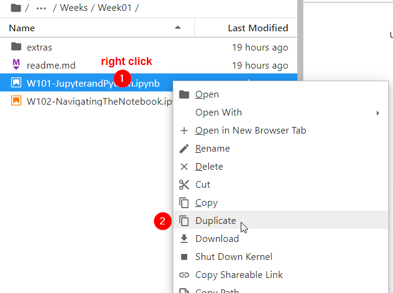
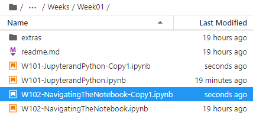

# Getting started each week
At the start of each week, you will be asked to update the class repository. Note that this is different from your own personaly repository. To do so, follow these instructions.

## Week 1
This is the first time you will interact with the class material. You are asked to clone the repository into your JupyterHub.

#### 1. Log into the class [Jupyter Hub](https://jupyter.idre.ucla.edu/)
#### 2. Go to New, Terminal
<kbd></kbd>
#### 3. In the command prompt, type (or copy/paste) the following:

`git clone https://github.com/yohman/up206a.git`

You should now have a copy of the class repo in your JupyterHub. Look for a folder `up206a` and navigate to `Weeks` and `Week1`. 

As you will be working on the notebooks (files with an .ipynb extension) during the lecture, *make a copy of these files first*.

Check the box next to each .ipynb file and duplicate as shown below:

<kbd></kbd>

Your directory should now look like this:

<kbd></kbd>

When you follow the course lecture, make sure to work on the copy files!

## Week 2 and beyond
Since you already have a copy of the class repo in your JupyterHub, you no longer need to clone the repo. Instead, you will have to *pull* new material into your copy within JupyterHub.

#### 1. Log into the class [Jupyter Hub](https://jupyter.idre.ucla.edu/)

#### 2. Go to New, Terminal
<kbd></kbd>

#### 3. In the command prompt, type (or copy/paste) the following:

1. `cd up206a`
1. `git pull`

<kbd></kbd>

Follow the same logic as you did in Week 1: Copy each .ipynb file and follow the lecture with the copied notebook file.
