# Download Census Data from Social Explorer

Go to: https://www.socialexplorer.com/

Check that you are using the campus VPN.

Create an account and log in.

<kbd>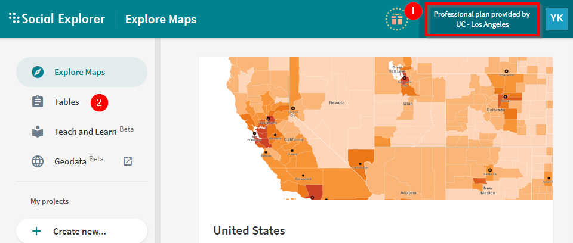</kbd>

Go to `Tables` and `Create report`

<kbd>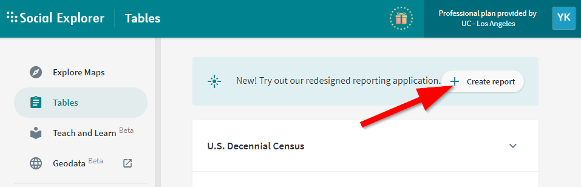</kbd>

Choose the latest 5 year ACS estimate

<kbd>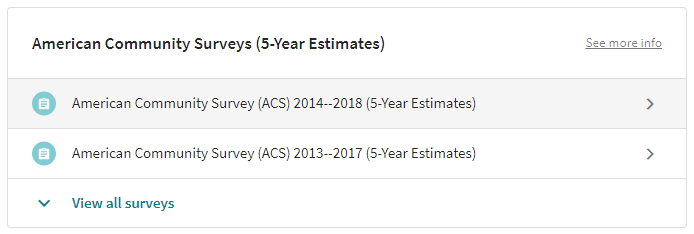</kbd>

Drill down and select Census Tracts

<kbd>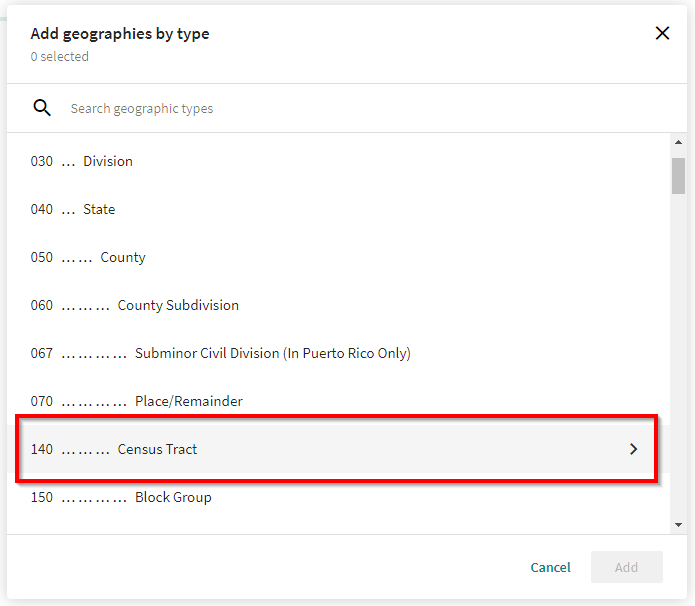</kbd>

Select `California`, `Los Angeles County`, check all census tracts in LA County, and click `Add`

<kbd>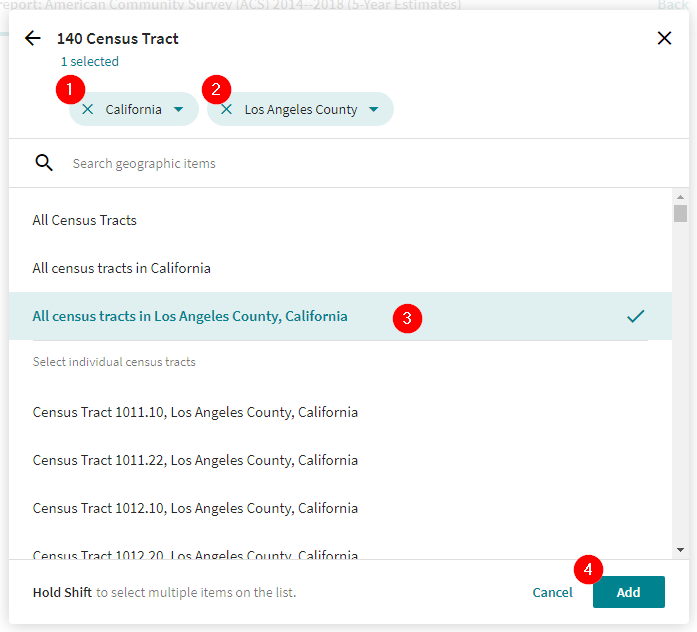</kbd>

Search and add the tables of your choice, and `Create report`

<kbd>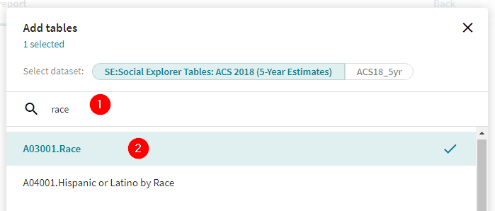</kbd>

<kbd>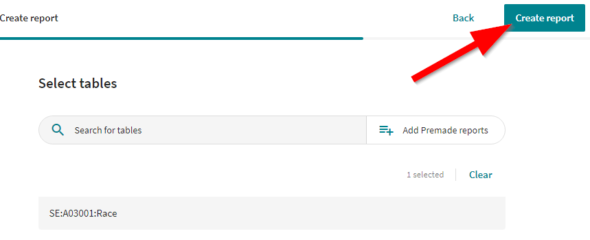</kbd>

In the download column, choose `CSV`

<kbd>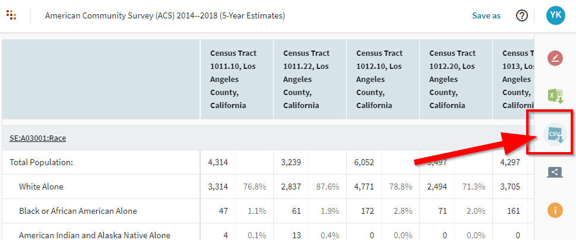</kbd>

Optionally, choose to output percents

<kbd>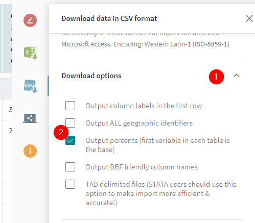</kbd>

Download the data

<kbd>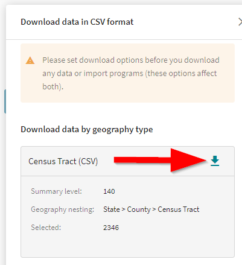</kbd>

Download the data dictionary

<kbd>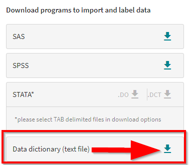</kbd>
